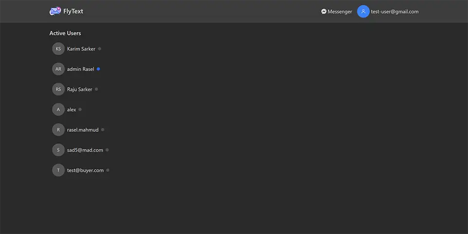
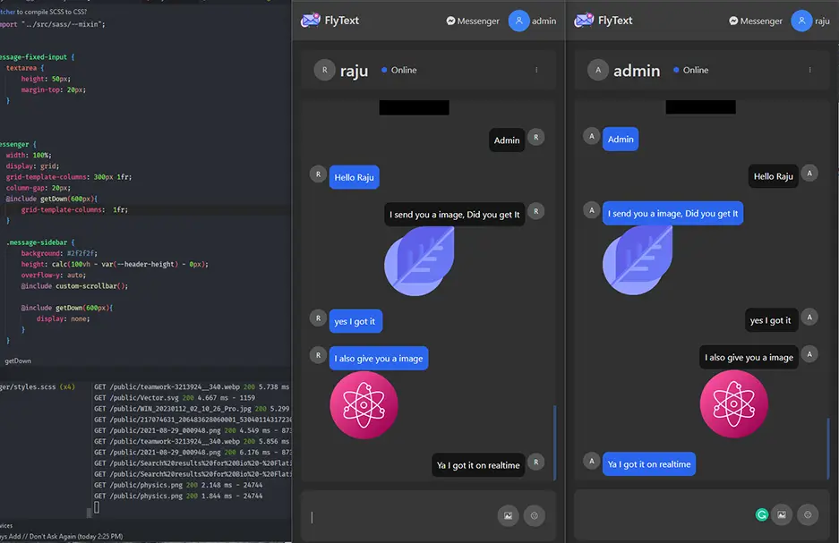
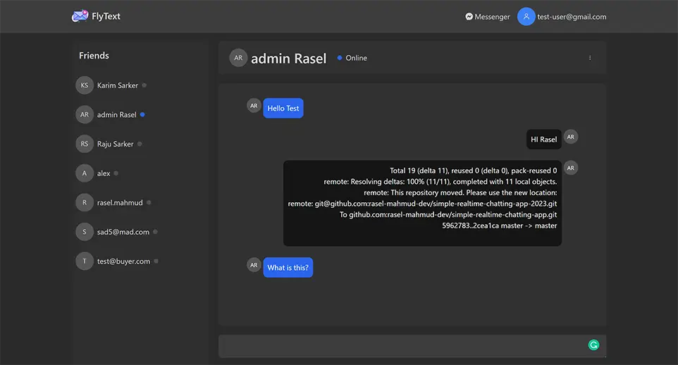
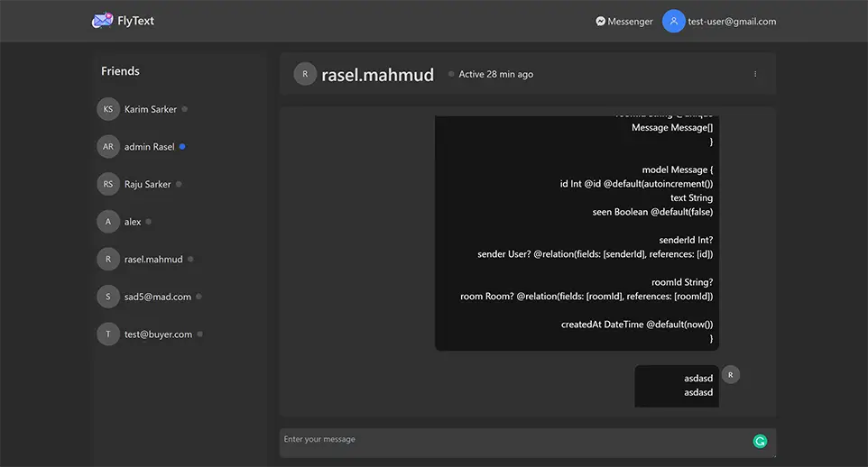

## Realtime Chatting Application (2023)


### Run Projects
```bash

// run frontend
cd client && yarn dev 

// run server
cd api && yarn dev

// migrate database 
npx prisma migrate dev


```


### Features 
- login and registration.
- user can see who are in currently online (activity status).
- user active status update when he/she leave site or login /logout
- user can create private room to send message one to one. like facebook chat.
- realtime multiple image upload with text message.
- use can see their previous chat messages.

### Database
- MySQL(Prisma ORM)


### Model
User 
- username
- password
- email 
- isOnline (boolean)
- lastActive Date


Room
- roomId (unique)

Message
- text 
- files JSON
- senderId (User)
- receiverId (User)
- roomId (Room Table rootId ref)
- createdAt 
- seen (boolean)


### Packages 
- ReactJS
- Redux-toolKit
- Context
- Socket.io
- Prisma (ORM)
- ExpressJS
- jsonwebtoken
- MySql


### Previews 
Homepage list of users


Chat with images


Messenger



